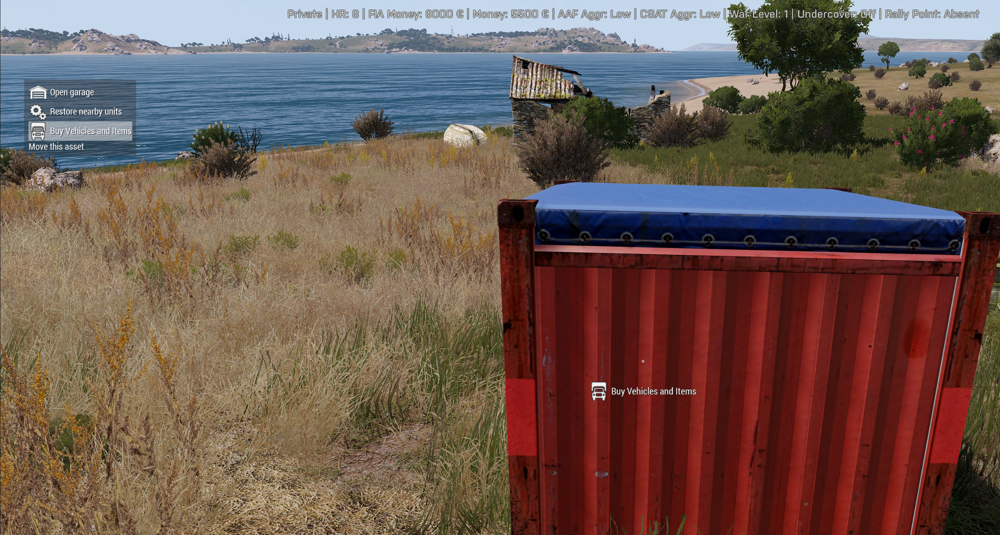

# A3U extender blank example - Adding utility items

This working example demonstrates how to add new items to the rebel buy menu.
That's the buy menu you get by selecting "Buy Vehicles and Items" from either
the vehicle box or a flag of any captured location, specifically, its 
**"Other"** section (a.k.a. "utility items").



This working example adds three supply boxes you can lug around and store stuff
in; maybe also cargo-load them. The tutorial, however, will cover the basics of
adding items.

## Configuration

Things you can buy in that shop section are simply _vehicles_, i.e. they're
configured in `CfgVehicles`. This example will restrict itself to adding those
to the rebel buy menu, we're not going to deep-dive into creating vehicles.

Utility items are configured in their corresponding config section and SHOULD
be derived from items' `Base` class:

```sqf
class A3A {
    class UtilityItems {
        // Forward declare parent class
        class Base;

        // Our item (also the _exact_ class name as defined in `CfgVehicles`)
        class GVAR(MyItem): Base {
            // Make it available
            scope = 1;

            // Optional; will override the item's own displayName property
            displayName = "";

            // Undiscounted item price
            price = 0;

            // ENUM value of available icon types
            iconType = "";

            // ARRAY of flag STRINGS
            flags[] = {};
        };
    };
};
```

### Properties

Property      | Default value | Description
--------------|---------------|------------
`displayName` | `""`          | Text below item's preview picture. Will be filled from the `displayName` property of the item if empty.
`iconType`    | `""`          | Can be one of "build", "gear", "heal", "light", "lootbox", "rearm", "refuel", "repair", "revivebox"
`flags`       | `{}`          | Adds actions to the utility item. See below.
`price`       | `0`           | Undiscounted item price
`scope`       | `0`           | Items with non-zero value will be shown in the utility items list

### Flags

Flag             | Description
-----------------|------------
`build`          | Item will be treated as a build box that triggers the base builder. Builder budget is item price.
`loot`           | Item will be treated as a loot box, the "collect loot" hold action will be added to it.
`move`           | Item gets the "Move this asset" interaction to carry it around
`noclear`        | Don't empty the item's inventory
`pack`, `unpack` | Item can be packed up for use with logistics system
`revivekit`      | Item treated like a revive kit
`rotate`         | Item can be rotated
`save`           | Item will become part of the save game once placed
